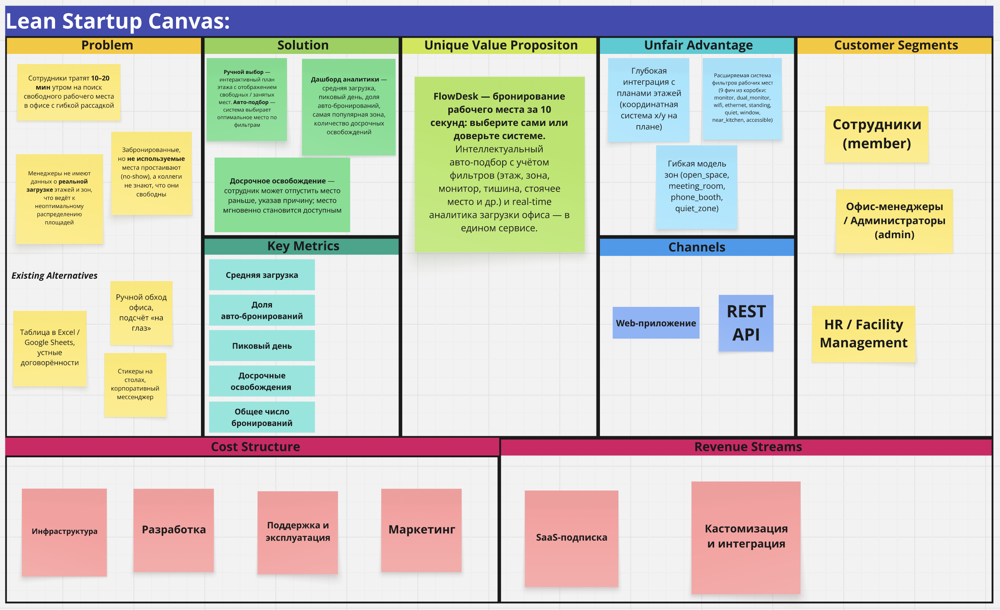

# Lean Canvas — FlowDesk

> Бизнес-модель продукта для системы автоматизации гибких рабочих мест

---

  

> 🔗 [Открыть в Miro](https://miro.com/app/board/uXjVHefIHJw=/?share_link_id=187266104220)

---
## 1. Проблема (Problem)

| # | Проблема | Текущая альтернатива |
|---|----------|---------------------|
| 1 | Сотрудники тратят **10–20 мин** утром на поиск свободного рабочего места в офисе с гибкой рассадкой | Таблица в Excel / Google Sheets, устные договорённости |
| 2 | Менеджеры не имеют данных о **реальной загрузке** этажей и зон, что ведёт к неоптимальному распределению площадей | Ручной обход офиса, подсчёт «на глаз» |
| 3 | Забронированные, но **не используемые** места простаивают (no-show), а коллеги не знают, что они свободны | Стикеры на столах, корпоративный мессенджер |

---

## 2. Сегменты клиентов (Customer Segments)

| Сегмент | Описание |
|---------|----------|
| **Сотрудники (member)** | Рядовые работники, которые ежедневно выбирают рабочее место (ручной или автоматический подбор) |
| **Офис-менеджеры / Администраторы (admin)** | Управляют каталогом этажей, зон и рабочих мест; анализируют загрузку; могут отменять чужие брони |
| **HR / Facility Management** | Используют аналитику для планирования площадей, принятия решений об аренде и ремонте зон |

---

## 3. Уникальное ценностное предложение (Unique Value Proposition)

> **FlowDesk — бронирование рабочего места за 10 секунд: выберите сами или доверьте системе.**
>
> Интеллектуальный авто-подбор с учётом фильтров (этаж, зона, монитор, тишина, стоячее место и др.) и real-time аналитика загрузки офиса — в едином сервисе.

---

## 4. Решение (Solution)

| Проблема | Решение в FlowDesk |
|----------|---------------------|
| Поиск места | **Ручной выбор** — интерактивный план этажа с отображением свободных / занятых мест. **Авто-подбор** — система выбирает оптимальное место по фильтрам (этаж, зона, фичи: монитор, тишина, стоячее место и др.) |
| Нет аналитики | **Дашборд аналитики** — средняя загрузка, пиковый день, доля авто-бронирований, самая популярная зона, количество досрочных освобождений |
| Простой мест | **Досрочное освобождение** — сотрудник может отпустить место раньше, указав причину; место мгновенно становится доступным |

---

## 5. Каналы (Channels)

| Канал | Описание |
|-------|----------|
| **Web-приложение** | Основной интерфейс — SPA с интерактивными планами этажей |
| **REST API** | Позволяет интеграцию с корпоративными системами (календари, Slack-боты, мобильные приложения) |
| **Email / Push-уведомления** | Напоминание о бронировании, уведомление о досрочном освобождении (планируемый функционал) |

---

## 6. Потоки доходов (Revenue Streams)

| Модель | Описание |
|--------|----------|
| **SaaS-подписка** | Тариф по количеству рабочих мест: Free (до 20), Pro (до 200), Enterprise (без ограничений) |
| **Кастомизация и интеграция** | Доработки под конкретный офис (интеграция с СКУД, IoT-датчиками присутствия) |

---

## 7. Структура расходов (Cost Structure)

| Категория | Примеры |
|-----------|---------|
| **Инфраструктура** | Хостинг (VPS / Cloud), PostgreSQL, CI/CD |
| **Разработка** | Бэкенд (Go), фронтенд, мобильное приложение |
| **Поддержка и эксплуатация** | Мониторинг, техподдержка клиентов |
| **Маркетинг** | Продвижение в среде Facility Management и HR |

---

## 8. Ключевые метрики (Key Metrics)

| Метрика | Описание | Источник данных |
|---------|----------|-----------------|
| **Средняя загрузка (Average Occupancy)** | Доля занятых мест от общего числа (0–1) | `GET /analytics/summary → averageOccupancy` |
| **Доля авто-бронирований (Auto-pick Ratio)** | Какую долю бронирований делает авто-подбор | `GET /analytics/summary → autoPickRatio` |
| **Пиковый день (Peak Day)** | День недели с максимальной загрузкой | `GET /analytics/summary → peakDay` |
| **Досрочные освобождения (Early Releases)** | Число мест, отпущенных раньше срока | `GET /analytics/summary → earlyReleases` |
| **Общее число бронирований** | За период | `GET /analytics/summary → totalReservations` |

---

## 9. Нечестное преимущество (Unfair Advantage)

- Глубокая интеграция с планами этажей (координатная система `x/y` на плане)
- Расширяемая система фильтров рабочих мест (`9 фич` из коробки: monitor, dual_monitor, wifi, ethernet, standing, quiet, window, near_kitchen, accessible)
- Гибкая модель зон (`open_space`, `meeting_room`, `phone_booth`, `quiet_zone`)
- Exclusion constraint в PostgreSQL для гарантии отсутствия двойных бронирований на уровне БД

