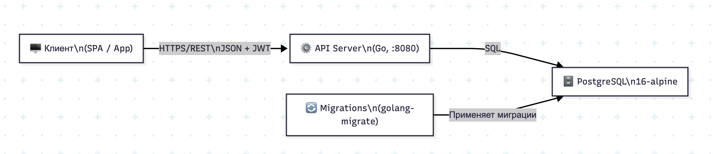
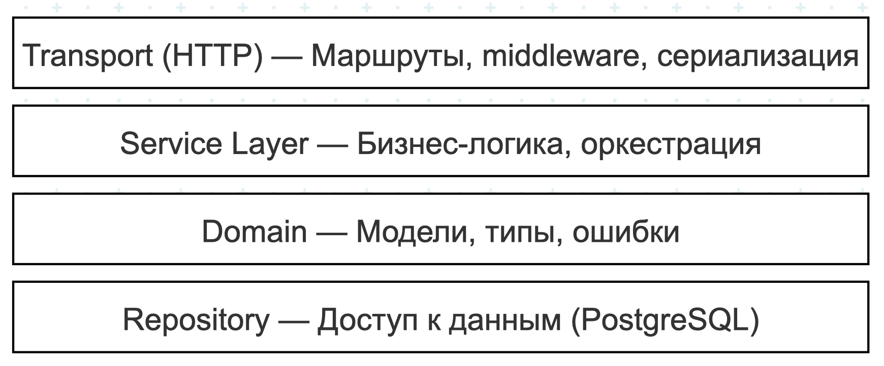
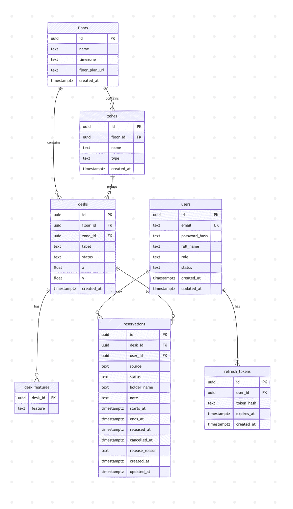

# Техническое задание (ТЗ) — FlowDesk

> Система автоматизации гибких рабочих мест в офисе

---

## 1. Общие сведения

| Параметр | Значение |
|----------|----------|
| **Название продукта** | FlowDesk |
| **Тип системы** | Web-приложение (SPA + REST API) |
| **Назначение** | Автоматизация выбора, резервирования и освобождения рабочих мест в офисах с гибкой рассадкой (hot-desking) |
| **Целевая аудитория** | Сотрудники и администраторы офисов с гибкими рабочими местами |

---

## 2. Цели и задачи

### 2.1 Бизнес-цели
1. Сократить время поиска рабочего места с 10–20 минут до 10 секунд
2. Обеспечить прозрачность загрузки офисных площадей для принятия управленческих решений
3. Снизить процент простоя рабочих мест за счёт механизма досрочного освобождения

### 2.2 Функциональные задачи
1. Реализовать каталог офисных пространств: этажи → зоны → рабочие места
2. Реализовать систему бронирования мест (ручной и автоматический режимы)
3. Реализовать систему аутентификации и авторизации пользователей
4. Реализовать аналитический дашборд загрузки

---

## 3. Функциональные требования

### 3.1 Модуль аутентификации (Auth)

| ID | Требование | Приоритет |
|----|-----------|-----------|
| FR-AUTH-01 | Система ДОЛЖНА позволять регистрацию пользователей по email, паролю и ФИО | Высокий |
| FR-AUTH-02 | Система ДОЛЖНА позволять аутентификацию по email и паролю с выдачей JWT-токенов (access + refresh) | Высокий |
| FR-AUTH-03 | Система ДОЛЖНА позволять обновление access-токена по refresh-токену | Высокий |
| FR-AUTH-04 | Пароль ДОЛЖЕН содержать минимум 8 символов | Средний |
| FR-AUTH-05 | Система ДОЛЖНА поддерживать роли: `member` и `admin` | Высокий |
| FR-AUTH-06 | Система ДОЛЖНА поддерживать статусы пользователей: `active` и `disabled` | Средний |

### 3.2 Модуль каталога (Floors / Zones / Desks)

| ID | Требование | Приоритет |
|----|-----------|-----------|
| FR-CAT-01 | Система ДОЛЖНА хранить справочник этажей с наименованием и временной зоной | Высокий |
| FR-CAT-02 | Каждый этаж МОЖЕТ содержать ссылку на план этажа (`floorPlanUrl`) | Средний |
| FR-CAT-03 | Система ДОЛЖНА поддерживать зоны внутри этажей с типами: `open_space`, `meeting_room`, `phone_booth`, `quiet_zone` | Высокий |
| FR-CAT-04 | Система ДОЛЖНА хранить каталог рабочих мест с координатами на плане (`x`, `y` в процентах) | Высокий |
| FR-CAT-05 | Каждое рабочее место ДОЛЖНО иметь набор характеристик (фичей): `monitor`, `dual_monitor`, `wifi`, `ethernet`, `standing`, `quiet`, `window`, `near_kitchen`, `accessible` | Высокий |
| FR-CAT-06 | Каждое рабочее место ДОЛЖНО иметь состояние: `active` (доступно для бронирования) или `disabled` (временно недоступно) | Высокий |
| FR-CAT-07 | Система ДОЛЖНА предоставлять API для получения списка мест с фильтрацией по этажу, зоне и набору фичей | Высокий |
| FR-CAT-08 | Система ДОЛЖНА предоставлять API проверки доступности конкретного места по временным слотам | Средний |

### 3.3 Модуль бронирования (Reservations)

| ID | Требование | Приоритет |
|----|-----------|-----------|
| FR-RES-01 | Система ДОЛЖНА позволять **ручное бронирование** конкретного места на заданный временной интервал | Высокий |
| FR-RES-02 | Система ДОЛЖНА позволять **автоматический подбор** места по фильтрам (этаж, зона, фичи) | Высокий |
| FR-RES-03 | Система ДОЛЖНА предоставлять **превью авто-подбора** (предложение места без бронирования) | Средний |
| FR-RES-04 | Система ДОЛЖНА исключать **пересечения бронирований** одного места по времени на уровне базы данных (EXCLUDE constraint) | Высокий |
| FR-RES-05 | Система ДОЛЖНА поддерживать **отмену бронирования** (cancel) авторизованным пользователем или администратором | Высокий |
| FR-RES-06 | Система ДОЛЖНА поддерживать **досрочное освобождение** места (release) с указанием причины | Высокий |
| FR-RES-07 | Система ДОЛЖНА автоматически заполнять имя владельца брони (`holderName`) из профиля пользователя | Средний |
| FR-RES-08 | Бронирование ДОЛЖНО хранить источник создания: `manual` или `auto` | Средний |
| FR-RES-09 | Бронирование ДОЛЖНО поддерживать статусы: `active`, `cancelled`, `completed` | Высокий |
| FR-RES-10 | Система ДОЛЖНА предоставлять API для получения списка бронирований с фильтрацией по месту, этажу, статусу и временному диапазону | Средний |

### 3.4 Модуль аналитики (Analytics)

| ID | Требование | Приоритет |
|----|-----------|-----------|
| FR-ANA-01 | Система ДОЛЖНА рассчитывать **среднюю загрузку** (average occupancy) по временно-взвешенной формуле | Высокий |
| FR-ANA-02 | Система ДОЛЖНА определять **пиковый день** недели и пиковую загрузку | Средний |
| FR-ANA-03 | Система ДОЛЖНА рассчитывать **долю авто-бронирований** от общего числа | Средний |
| FR-ANA-04 | Система ДОЛЖНА подсчитывать **общее число бронирований** и **досрочных освобождений** за период | Средний |
| FR-ANA-05 | Система ДОЛЖНА определять **самую популярную зону** за период | Средний |
| FR-ANA-06 | Аналитический API ДОЛЖЕН поддерживать фильтрацию по этажу и временному диапазону | Средний |

---

## 4. Нефункциональные требования

| ID | Категория | Требование |
|----|-----------|-----------|
| NFR-01 | **Безопасность** | Все операции создания и изменения бронирований ДОЛЖНЫ требовать JWT Bearer аутентификации |
| NFR-02 | **Безопасность** | Пароли ДОЛЖНЫ храниться в виде хешей (bcrypt) |
| NFR-03 | **Безопасность** | Отмена и досрочное освобождение чужой брони ДОЛЖНЫ быть доступны только администраторам |
| NFR-04 | **Целостность данных** | Пересечение активных бронирований одного места ДОЛЖНО блокироваться на уровне БД (EXCLUDE USING GIST) |
| NFR-05 | **Целостность данных** | Время начала бронирования ДОЛЖНО быть строго раньше времени окончания (CHECK constraint) |
| NFR-06 | **Производительность** | API ДОЛЖЕН отвечать за ≤ 200 мс для каталожных запросов (p95) |
| NFR-07 | **Производительность** | Аналитика ДОЛЖНА обрабатывать до 10 000 бронирований за один запрос |
| NFR-08 | **Масштабируемость** | Архитектура ДОЛЖНА позволять горизонтальное масштабирование API-серверов |
| NFR-09 | **Развёртывание** | Система ДОЛЖНА разворачиваться через Docker Compose (PostgreSQL, миграции, API) |
| NFR-10 | **Совместимость** | API ДОЛЖЕН соответствовать спецификации OpenAPI 3.1.0 |

---

## 5. Архитектура системы

### 5.1 Общая архитектура

  

### 5.2 Слои приложения

  

### 5.3 Модель данных (ER-диаграмма)

  

---

## 6. Технологический стек

| Компонент | Технология | Версия |
|-----------|-----------|--------|
| **Бэкенд** | Go | latest |
| **База данных** | PostgreSQL | 16-alpine |
| **Миграции** | golang-migrate | latest |
| **Аутентификация** | JWT (access + refresh) | — |
| **Контейнеризация** | Docker, Docker Compose | — |
| **Спецификация API** | OpenAPI | 3.1.0 |

---

## 7. API эндпоинты (сводка)

| Метод | Путь | Тег | Описание |
|-------|------|-----|----------|
| POST | `/auth/register` | Auth | Регистрация пользователя |
| POST | `/auth/login` | Auth | Вход в систему |
| POST | `/auth/refresh` | Auth | Обновление токенов |
| GET | `/floors` | Floors | Список этажей |
| GET | `/floors/{floorId}` | Floors | Детали этажа с местами |
| GET | `/desks` | Desks | Список мест (с фильтрами) |
| GET | `/desks/{deskId}` | Desks | Информация о месте |
| GET | `/desks/{deskId}/availability` | Desks | Доступность по слотам |
| GET | `/reservations` | Reservations | Список бронирований 🔒 |
| POST | `/reservations` | Reservations | Ручное бронирование 🔒 |
| POST | `/reservations/auto` | Auto-pick | Авто-бронирование 🔒 |
| POST | `/reservations/auto/preview` | Auto-pick | Превью авто-подбора 🔒 |
| GET | `/reservations/{reservationId}` | Reservations | Получить бронь 🔒 |
| DELETE | `/reservations/{reservationId}` | Reservations | Отменить бронь 🔒 |
| POST | `/reservations/{reservationId}/release` | Reservations | Досрочное освобождение 🔒 |
| GET | `/analytics/summary` | Analytics | Сводная аналитика |

🔒 — требует JWT Bearer аутентификации

---

## 8. Ограничения и допущения

1. В текущей версии отсутствует пользовательский интерфейс (фронтенд) — взаимодействие через REST API
2. Авто-подбор выбирает первое подходящее место по алфавитному порядку метки (`label ASC`)
3. Аналитика ограничена 10 000 бронированиями за один запрос
4. Система рассчитана на один офис (multi-tenancy не реализован)
5. Уведомления (email, push) не реализованы в текущей версии
