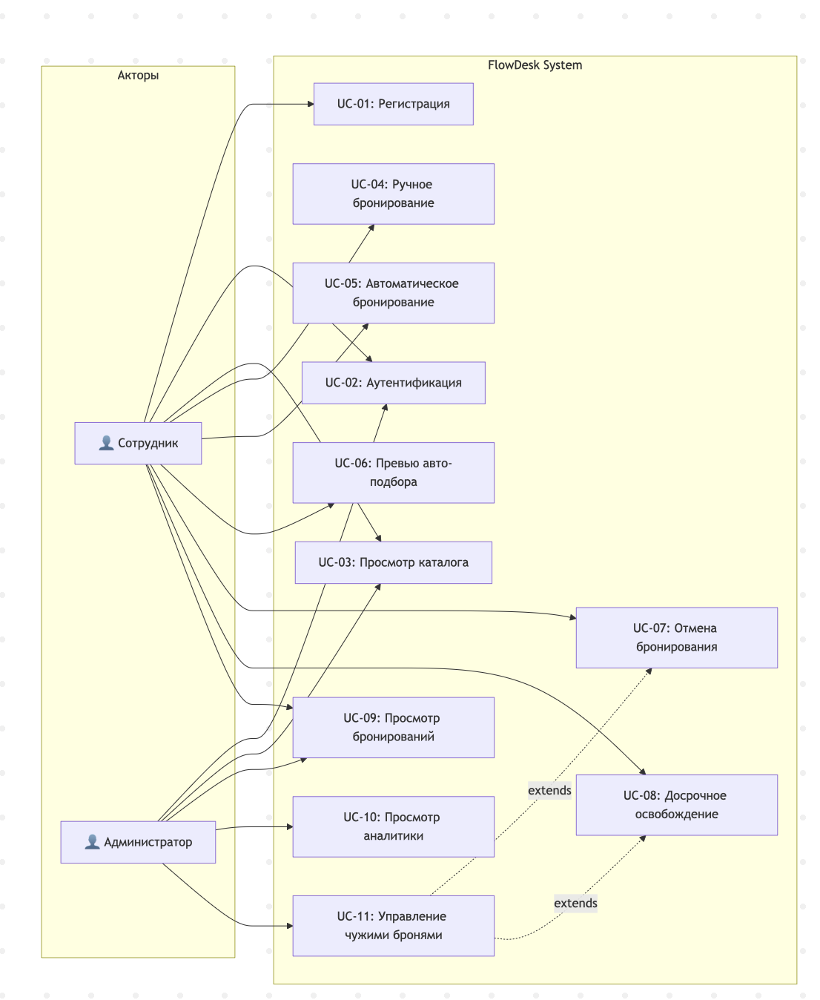
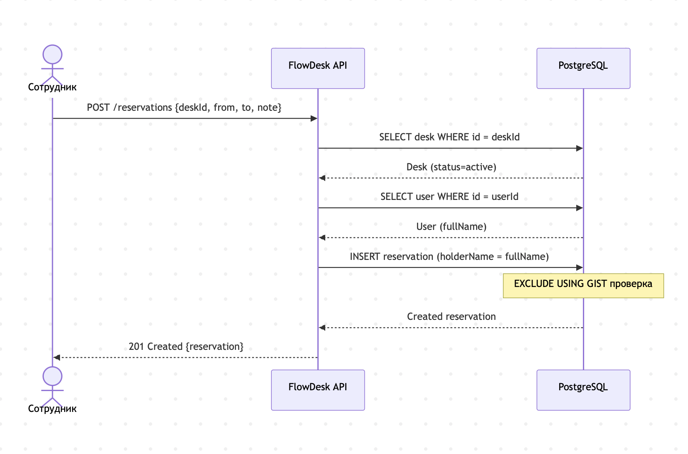
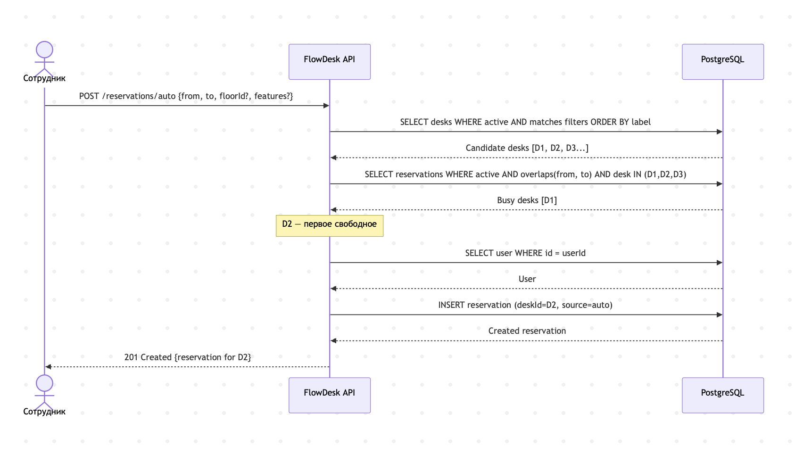

# Use Cases (UC) — FlowDesk

> Варианты использования системы автоматизации гибких рабочих мест

---

## Акторы

| Актор | Описание |
|-------|----------|
| **Сотрудник** | Аутентифицированный пользователь с ролью `member` |
| **Администратор** | Аутентифицированный пользователь с ролью `admin` |
| **Система** | FlowDesk API Server (автоматические действия) |

---

## Диаграмма вариантов использования

  

---

## UC-01: Регистрация пользователя

| Поле | Значение |
|------|----------|
| **ID** | UC-01 |
| **Название** | Регистрация пользователя |
| **Актор** | Сотрудник (новый) |
| **Предусловие** | Пользователь не зарегистрирован в системе |
| **Постусловие** | Пользователь создан, получены JWT-токены |
| **API** | `POST /auth/register` |

**Основной сценарий:**
1. Сотрудник отправляет запрос с `email`, `password` (≥ 8 символов) и `fullName`
2. Система проверяет уникальность email
3. Система хеширует пароль (bcrypt) и создаёт запись пользователя с ролью `member` и статусом `active`
4. Система генерирует пару JWT-токенов (access + refresh)
5. Система возвращает `201 Created` с данными пользователя и токенами

**Альтернативные сценарии:**

| Шаг | Условие | Результат |
|-----|---------|-----------|
| 2 | Email уже существует | `409 Conflict` — «user already exists» |
| 1 | Пароль < 8 символов | `400 Bad Request` — «password too short» |
| 1 | Некорректный формат email | `400 Bad Request` — «invalid email» |

---

## UC-02: Аутентификация (вход)

| Поле | Значение |
|------|----------|
| **ID** | UC-02 |
| **Название** | Аутентификация пользователя |
| **Актор** | Сотрудник, Администратор |
| **Предусловие** | Пользователь зарегистрирован |
| **Постусловие** | Получены JWT-токены доступа |
| **API** | `POST /auth/login` |

**Основной сценарий:**
1. Пользователь отправляет `email` и `password`
2. Система находит пользователя по email
3. Система проверяет хеш пароля
4. Система проверяет, что статус пользователя = `active`
5. Система генерирует пару JWT-токенов
6. Система возвращает `200 OK` с данными пользователя и токенами

**Альтернативные сценарии:**

| Шаг | Условие | Результат |
|-----|---------|-----------|
| 2 | Пользователь не найден | `401 Unauthorized` |
| 3 | Неверный пароль | `401 Unauthorized` |
| 4 | Статус = `disabled` | `403 Forbidden` |

---

## UC-03: Просмотр каталога рабочих мест

| Поле | Значение |
|------|----------|
| **ID** | UC-03 |
| **Название** | Просмотр каталога рабочих мест |
| **Актор** | Сотрудник, Администратор |
| **Предусловие** | — (не требует аутентификации) |
| **Постусловие** | Актор получил информацию о доступных местах |
| **API** | `GET /floors`, `GET /floors/{floorId}`, `GET /desks`, `GET /desks/{deskId}`, `GET /desks/{deskId}/availability` |

**Основной сценарий:**
1. Пользователь запрашивает список этажей
2. Система возвращает массив этажей с `id`, `name`, `timezone`, `floorPlanUrl`
3. Пользователь выбирает этаж и запрашивает его детали
4. Система возвращает этаж с зонами и рабочими местами (включая координаты и фичи)
5. Пользователь может отфильтровать места по `floorId`, `zoneId`, `features`
6. Пользователь может проверить доступность конкретного места по временным слотам

**Альтернативные сценарии:**

| Шаг | Условие | Результат |
|-----|---------|-----------|
| 3 | Этаж не найден | `404 Not Found` |
| 5 | Некорректные фильтры | `400 Bad Request` |
| 6 | Место не найдено | `404 Not Found` |

---

## UC-04: Ручное бронирование рабочего места

| Поле | Значение |
|------|----------|
| **ID** | UC-04 |
| **Название** | Ручное бронирование рабочего места |
| **Актор** | Сотрудник |
| **Предусловие** | Сотрудник аутентифицирован; выбранное место в статусе `active` |
| **Постусловие** | Создана бронь со статусом `active` и источником `manual` |
| **API** | `POST /reservations` |

**Основной сценарий:**
1. Сотрудник указывает `deskId`, `from`, `to` и опционально `note`
2. Система проверяет, что место существует и имеет статус `active`
3. Система проверяет, что пользователь существует и активен
4. Система заполняет `holderName` из профиля пользователя (`fullName`)
5. Система создаёт бронирование (PostgreSQL EXCLUDE constraint гарантирует отсутствие пересечений)
6. Система возвращает `201 Created` с полными данными бронирования

**Альтернативные сценарии:**

| Шаг | Условие | Результат |
|-----|---------|-----------|
| — | Нет JWT-токена | `401 Unauthorized` |
| 2 | Место не найдено | `404 Not Found` |
| 2 | Место `disabled` | `409 Conflict` — «desk is not available for booking» |
| 5 | Пересечение по времени | `409 Conflict` — EXCLUDE constraint violation |
| 1 | `from ≥ to` | `400 Bad Request` |

  

---

## UC-05: Автоматическое бронирование

| Поле | Значение |
|------|----------|
| **ID** | UC-05 |
| **Название** | Автоматический подбор и бронирование места |
| **Актор** | Сотрудник |
| **Предусловие** | Сотрудник аутентифицирован |
| **Постусловие** | Создана бронь со статусом `active` и источником `auto` |
| **API** | `POST /reservations/auto` |

**Основной сценарий:**
1. Сотрудник указывает `from`, `to`, опционально `floorId`, `zoneId`, `requiredFeatures`
2. Система запрашивает все `active` места, соответствующие фильтрам
3. Система batch-запрашивает все активные бронирования, пересекающиеся с запрошенным интервалом
4. Система отбирает первое свободное место по `label ASC`
5. Система создаёт бронирование с `source = auto`
6. Система возвращает `201 Created`

**Альтернативные сценарии:**

| Шаг | Условие | Результат |
|-----|---------|-----------|
| 2 | Нет мест, соответствующих фильтрам | `404 Not Found` |
| 4 | Все подходящие места заняты | `404 Not Found` — «no suitable active desk available» |

  

---

## UC-06: Превью авто-подбора

| Поле | Значение |
|------|----------|
| **ID** | UC-06 |
| **Название** | Предварительный просмотр авто-подбора |
| **Актор** | Сотрудник |
| **Предусловие** | Сотрудник аутентифицирован |
| **Постусловие** | Бронирование **не создаётся**, возвращается предложение |
| **API** | `POST /reservations/auto/preview` |

**Основной сценарий:**
1. Сотрудник указывает те же параметры, что и для авто-бронирования
2. Система выполняет подбор аналогично UC-05, но **без создания** бронирования
3. Система возвращает `200 OK` с предложенным местом, оценкой (`score`) и списком причин выбора

**Причины выбора (reasons):**
- `"matched floorId=<id>"` — совпадение по этажу
- `"matched zoneId=<id>"` — совпадение по зоне
- `"matched N required feature(s)"` — совпадение по фичам
- `"selected first active desk by label"` — без фильтров, первое по алфавиту

---

## UC-07: Отмена бронирования

| Поле | Значение |
|------|----------|
| **ID** | UC-07 |
| **Название** | Отмена бронирования |
| **Актор** | Сотрудник (свои), Администратор (любые) |
| **Предусловие** | Бронирование существует и имеет статус `active` |
| **Постусловие** | Статус = `cancelled`, зафиксирован `cancelledAt` |
| **API** | `DELETE /reservations/{reservationId}` |

**Основной сценарий:**
1. Пользователь отправляет запрос на отмену
2. Система проверяет, что бронирование принадлежит пользователю ИЛИ пользователь — администратор
3. Система обновляет статус на `cancelled` и фиксирует `cancelledAt`
4. Система возвращает `204 No Content`

**Альтернативные сценарии:**

| Шаг | Условие | Результат |
|-----|---------|-----------|
| 2 | Чужая бронь + role ≠ admin | `403 Forbidden` |
| 1 | Бронирование не найдено | `404 Not Found` |

---

## UC-08: Досрочное освобождение места

| Поле | Значение |
|------|----------|
| **ID** | UC-08 |
| **Название** | Досрочное освобождение рабочего места |
| **Актор** | Сотрудник (свои), Администратор (любые) |
| **Предусловие** | Бронирование существует, статус `active` |
| **Постусловие** | Статус = `completed`, зафиксированы `releasedAt` и `releaseReason` |
| **API** | `POST /reservations/{reservationId}/release` |

**Основной сценарий:**
1. Пользователь отправляет запрос с опциональным полем `reason`
2. Система проверяет принадлежность (или роль admin)
3. Система обновляет: `status → completed`, `releasedAt → NOW()`, `releaseReason → reason`
4. Система возвращает `200 OK` с обновлённым бронированием

**Альтернативные сценарии:**

| Шаг | Условие | Результат |
|-----|---------|-----------|
| 2 | Чужая бронь + role ≠ admin | `403 Forbidden` |
| 1 | Бронирование не найдено | `404 Not Found` |

---

## UC-09: Просмотр списка бронирований

| Поле | Значение |
|------|----------|
| **ID** | UC-09 |
| **Название** | Просмотр списка бронирований |
| **Актор** | Сотрудник, Администратор |
| **Предусловие** | Пользователь аутентифицирован |
| **Постусловие** | Получен список бронирований |
| **API** | `GET /reservations`, `GET /reservations/{reservationId}` |

**Основной сценарий:**
1. Пользователь запрашивает список бронирований с фильтрами: `deskId`, `floorId`, `from`, `to`, `status`
2. Система возвращает массив бронирований, обогащённых `deskLabel` и `floorId`
3. По умолчанию `status = active`

---

## UC-10: Просмотр аналитики загрузки

| Поле | Значение |
|------|----------|
| **ID** | UC-10 |
| **Название** | Просмотр сводной аналитики |
| **Актор** | Администратор |
| **Предусловие** | — (не требует аутентификации в текущей версии) |
| **Постусловие** | Получены метрики загрузки |
| **API** | `GET /analytics/summary` |

**Основной сценарий:**
1. Администратор запрашивает аналитику с опциональными фильтрами: `floorId`, `from`, `to`
2. Система агрегирует данные: средняя загрузка, пиковый день, доля auto-pick, досрочные освобождения, топ-зона
3. Если указан временной диапазон — используется **временно-взвешенная** формула загрузки
4. Если диапазон не указан — считается доля мест с активными бронями от общего числа
5. Система возвращает `200 OK` с `AnalyticsSummary`

**Альтернативные сценарии:**

| Шаг | Условие | Результат |
|-----|---------|-----------|
| 1 | `from` без `to` или наоборот | `400 Bad Request` — «from and to must be provided together» |
| 1 | `from ≥ to` | `400 Bad Request` — «from must be earlier than to» |

---

## UC-11: Управление чужими бронированиями

| Поле | Значение |
|------|----------|
| **ID** | UC-11 |
| **Название** | Управление бронированиями других пользователей |
| **Актор** | Администратор |
| **Предусловие** | Актор имеет роль `admin` |
| **Постусловие** | Бронирование отменено или досрочно завершено |
| **API** | `DELETE /reservations/{reservationId}`, `POST /reservations/{reservationId}/release` |

**Основной сценарий:**
1. Администратор находит бронирование по ID
2. Администратор выполняет отмену (UC-07) или досрочное освобождение (UC-08)
3. Система выполняет действие без проверки принадлежности (role = admin)

---

## Матрица трассировки UC ↔ US

| UC | Связанные US |
|----|-------------|
| UC-01 | US-AUTH-01 |
| UC-02 | US-AUTH-02, US-AUTH-03 |
| UC-03 | US-CAT-01, US-CAT-02, US-CAT-03, US-CAT-04 |
| UC-04 | US-RES-01 |
| UC-05 | US-RES-02 |
| UC-06 | US-RES-03 |
| UC-07 | US-RES-05 |
| UC-08 | US-RES-06 |
| UC-09 | US-RES-04 |
| UC-10 | US-ANA-01 |
| UC-11 | US-RES-07 |
